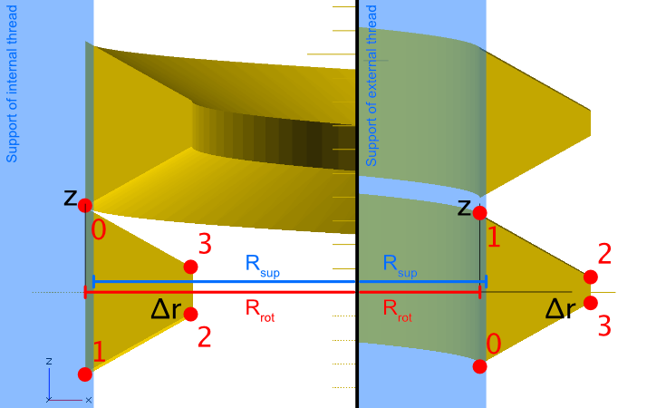

# BSP Parallel Threads (ISO 228-1)

British Standard Pipe parallel threads are commonly used in plumbing and hydraulic applications. This document explains the mathematical approach used by threadlib for BSP thread generation.

## Thread Profile Calculation

The general approach follows the principles described in [Creating Thread Specs](creating-thread-specs.md). The following diagram shows the theoretical parting line (black) with the actual internal (red) and external (blue) thread profiles overlaid.

*Note: Red and blue profiles show identical pitch diameters for clarity, but actual external and internal threads have different pitch diameters.*

## Implementation Details

The thread specification calculation is handled by the `calculateThreadlibSpecs()` function in `BSPP_thread.awk`.

### Calculation Steps

1. **Pitch (P)**: Taken directly from `BSPP_thread.csv`

2. **Pitch Diameter**:
   - External threads use smaller diameter (Class A tolerance)
   - Internal threads use larger diameter  
   - Both target center of acceptable range from standard

3. **Major/Minor Diameters**:
   - External: Center of acceptable range → `DMaxExt`
   - Internal: Center of acceptable range → `DMinInt`

4. **Support Diameter**:
   - Must remain on correct side of parting line
   - Calculated as pitch diameter ± 2 × 5/12 × H
   - H = full height of fundamental triangle
   - Sign depends on external/internal thread type

However, this is not yet what we need. As we do not want the rounding in the profile, we have to adjust the "crest" diameters of the straightened profile accordingly. Again, the criterion is to create a profile that strictly remains on its own side of the parting line.

Finally, we need the points (dr_i, z_i) of the thread profile. The radii are simple: 0, 0, (DCrest - DValley) / 2, (DCrest - DValley) / 2. To calculate the corresponding z-values, we use the triangle given by (half of) the crest/valley line and the corner of the fundamental triangle (compare first figure). Half of the line's length is then calculated as the height of said triangle times tan(φ/2). Using this, we calculate all 4 z-values from the crest and valley radii.
